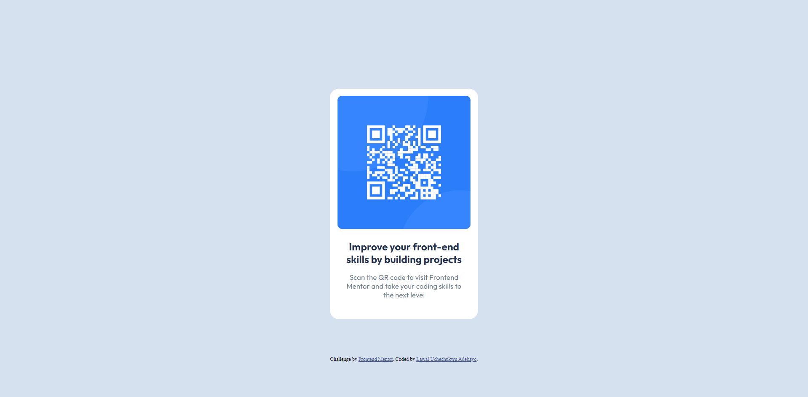

# Frontend Mentor - QR code component solution

This is a solution to the [QR code component challenge on Frontend Mentor](https://www.frontendmentor.io/challenges/qr-code-component-iux_sIO_H). Frontend Mentor challenges help you improve your coding skills by building realistic projects.

## Table of contents

- [Overview](#overview)
  - [Screenshot](#screenshot)
  - [Links](#links)
- [My process](#my-process)
  - [Built with](#built-with)
  - [What I learned](#what-i-learned)
  - [Continued development](#continued-development)
  - [Useful resources](#useful-resources)
- [Author](#author)
- [Acknowledgments](#acknowledgments)

### Screenshot

### Links

- Solution URL: [Solution URL](https://www.frontendmentor.io/solutions/first-frontend-mentor-qr-code-card-ez0R01Q8Lc)
- Live Site URL: [Live Site URL](https://emeraldknytt.github.io/qr-code-frontend/)

### Built with

- HTML5 markup
- CSS

## Acknowledgments

Special thanks to [RajanCP] (https://frontendmentor.io/profile/RajanCP) and [Blair] (https://x.xom/thatdancingdev) for their timely support and guidance.
